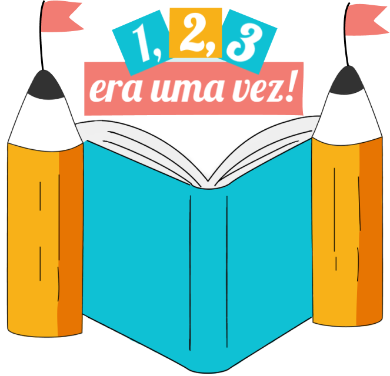

<h1 align="center">
  
</h1>

  <a href="#-o-projeto">O Projeto</a>&nbsp;&nbsp;&nbsp;|&nbsp;&nbsp;&nbsp;
  <a href="#-nossa-equipe">Nossa equipe</a>&nbsp;&nbsp;&nbsp;|&nbsp;&nbsp;&nbsp;
  <a href="#-layout">Layout</a>&nbsp;&nbsp;&nbsp;|&nbsp;&nbsp;&nbsp;
  <a href="#rocket-tecnologias">Tecnologias</a>

  
  

## 🎯 O Projeto
 **1, 2, 3... Era uma vez!** foi desenvolvido no [Mega Hack Women](https://www.megahackwomen.com.br/) com o objetivo de ajudar crianças de 5 a 9 anos a exercitar a leitura desenvolvendo sua imaginação de uma forma divertida para o pequeno leitor e sua família, com sugestões de atividades que permitem a participação de toda a casa nesse processo de aprendizagem. 
No aplicativo, a criança interage exercitando a imaginação através da criação de suas próprias histórias a partir da escolha de nomes, temas, ações e roteiros, além de ter acesso à histórias compartilhadas de outras crianças para ler - nesse espaço, a criança aprende brincando. 
Os pequenos podem se manter praticando a leitura de histórias feitas para suas respectivas idades acompanhando os textos, descobrindo novos caminhos para suas historinhas e desbloqueando novos roteiros dentro do aplicativo para criar cada vez mais, sempre recebendo mensagens de estímulo ao terminar de desenvolver ou ler alguma história, motivando-o a continuar praticando a leitura.

## 👥 Nossa equipe
- UI/UX - [Lívia Rodrigues](https://www.linkedin.com/in/l%C3%ADvia-rodrigues-1043631b4/)
- Negócios - [Barbara Abi](https://www.linkedin.com/in/barbara-abi/)
- Desenvolvimento - [Vitória Lopes](https://www.linkedin.com/in/vitorialopesdiogo/)
- Marketing - Safira Rosa

## 🔖 Layout
Você pode visualizar nosso layout desenvolvido pelo Figma por [aqui](https://www.figma.com/file/xCTqk8nbkRRv5joe0eAW8R/1-2-3...-Era-uma-vez?node-id=0%3A1).

### Créditos de mídia
Os ícones utilizados nesse projeto pertecem à plataforma [FlatIcon](https://www.flaticon.com/home). Dentre os desenvolvedores estão: [Freepik](https://www.flaticon.com/authors/freepik), [Vectors Market](https://www.flaticon.com/authors/vectors-market) e [Smashicons](https://www.flaticon.com/authors/smashicons).

## :rocket: Tecnologias
- [React Native](https://reactnative.dev/)
- [Expo](https://expo.io/)
- [Javascript](https://developer.mozilla.org/pt-BR/docs/Web/JavaScript)
