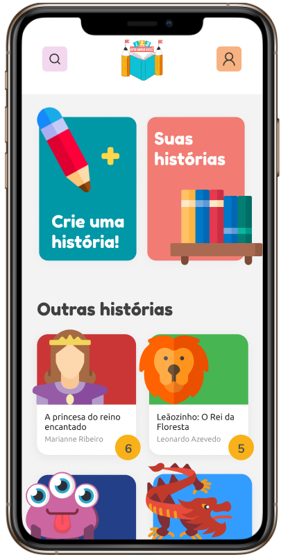

<h1 align="center">1, 2, 3... Era uma vez!</h1>

  
  

## 🎯 O Projeto
**1, 2, 3... Era uma vez!** foi desenvolvido no [Mega Hack Women](https://www.megahackwomen.com.br/) com o objetivo de ajudar crianças de 5 a 9 anos a exercitar a leitura desenvolvendo sua imaginação de uma forma divertida para o pequeno leitor e sua família, com sugestões de atividades que permitem a participação de toda a casa nesse processo de aprendizagem.

## :rocket: Tecnologias
- [React Native](https://reactnative.dev/)
- [json-server](https://github.com/typicode/json-server)
- [Expo](https://expo.io/)

## 👯‍♂️ Nossa equipe
- **Lívia Rodrigues** - UI/UX e Business
- **Barbara Abi** - Marketing e Business
- **Vitória Lopes** - UI/UX e Desenvolvimento
- **Safira Rosa** - Marketing e Business

## 🔖 Layout
Você pode usar nosso layout desenvolvido pelo Figma por [aqui](https://www.figma.com/proto/xCTqk8nbkRRv5joe0eAW8R/1%2C-2%2C-3...-Era-uma-vez!?node-id=1%3A2&scaling=scale-down).
